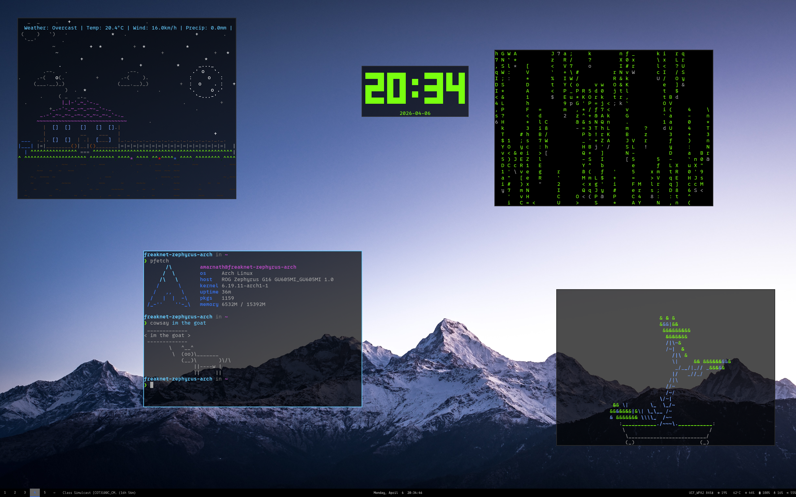
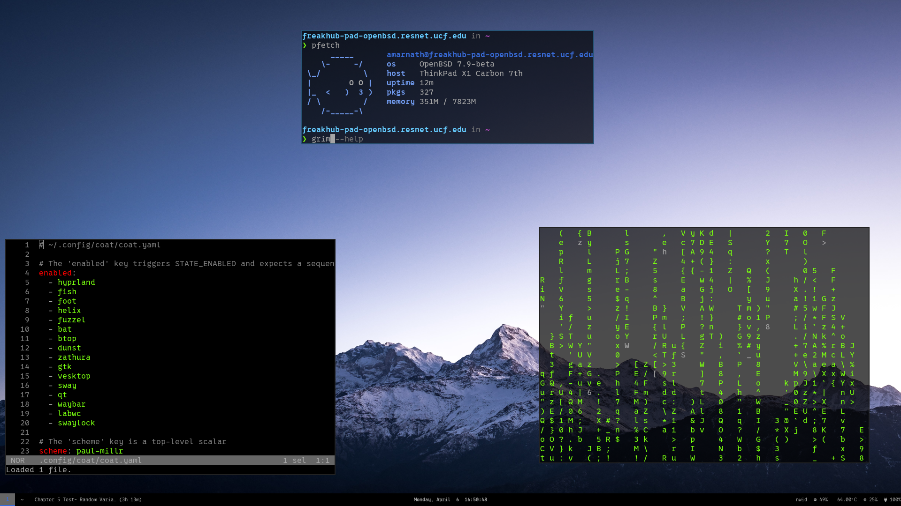
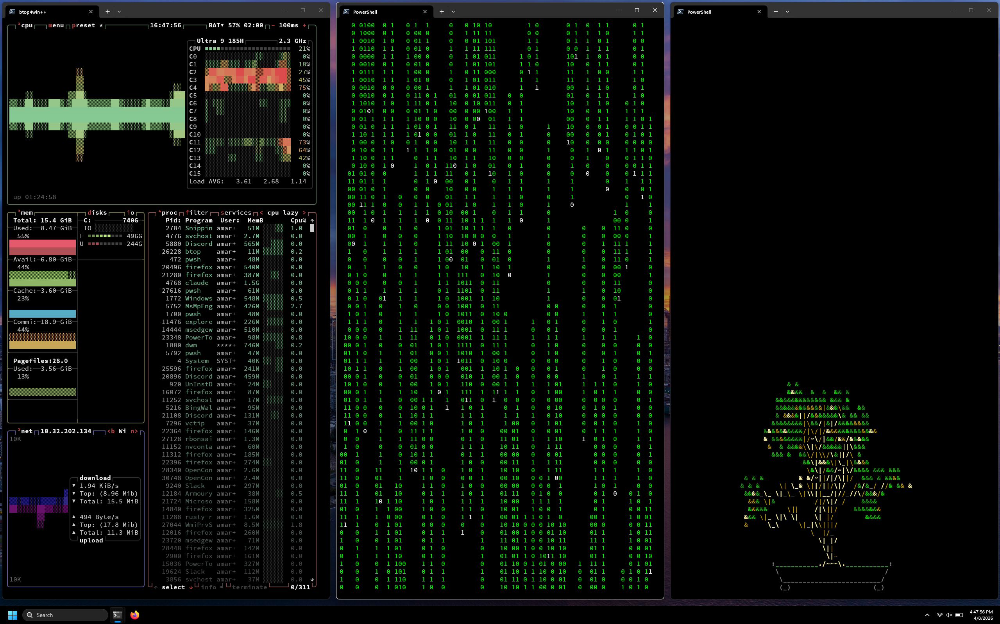

# dotfiles

  

sway · foot · fish · helix · fuzzel · waybar · coat · glazewm

arch linux · openbsd · windows 11

---

**deps:** stow, [coat](https://github.com/jeebuscrossaint/coat)

```sh
git clone https://github.com/jeebuscrossaint/.dotfiles ~/.dotfiles
cd ~/.dotfiles && stow linux
coat apply
```

set canvas url for the assignment waybar module:
```sh
echo "YOUR_URL" > ~/.config/canvas/ical-url
```

install nerd fonts on openbsd (or anywhere without packages):
```sh
./install-nerdfonts.sh
```

---

**extensions:** uBlock Origin · SponsorBlock · BetterCanvas · Return YouTube Dislike · Proton Pass · Dark Reader
